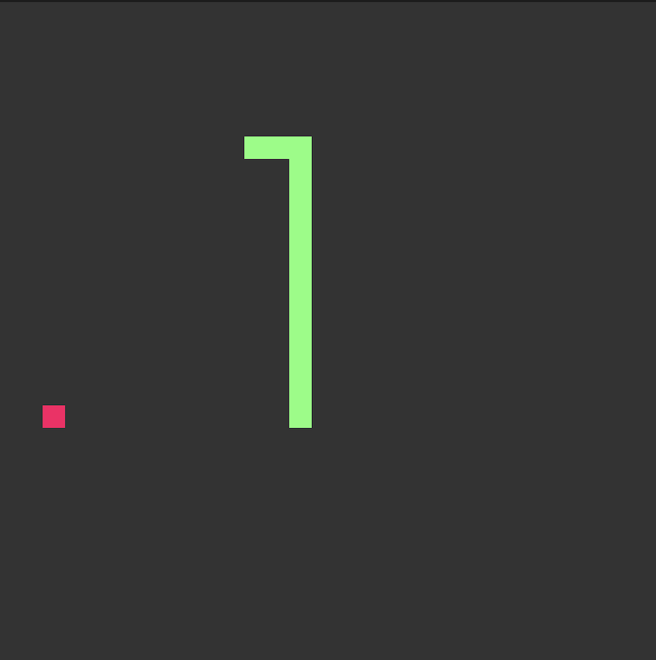
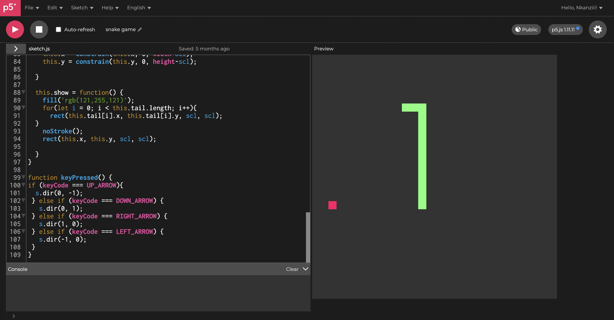

<h1>Snake-game</h1>

  
    

<h2>🐍 SERPENT // ARCADE</h2>

A retro arcade Snake game built with p5.js — dodge your own tail, eat to grow, and chase   the high score. Features neon CRT aesthetics, smooth controls, and increasing speed as you  level up. Pure browser, no dependencies beyond p5.js.

